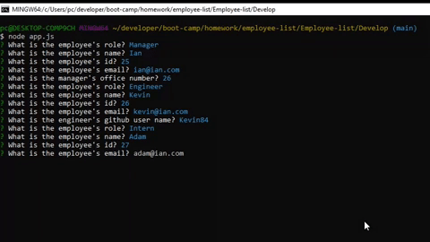

# Employee-List 
  

  ## **Table of Contents**
  1. [Description](#Description)
  2. [Technology](#Technology)
  3. [Usage](#Usage)
  4. [License](#License)
  5. [Contributors](#Contributors)
  6. [Questions](#Questions)
  
  > ## **Description**
  ### A command line interface application that takes user input to generate an html template displaying information received from the user.  The user is prompted with a selection of different roles for an engineering team, including manager, engineer and intern.  The application asks the user for name, id and email.  All this infromation is stored and displayed once the user has completed creating their team.
 
  > ## **Installation**
      1. Inquirer 
      2. Javascript 
      3. HTML 
      4. node.js
 
  > ## **Usage**
  ### 

  > ## **License**
  ### I have choosen the Unlicense/Other license.  For further information on licenses please visit [Choose a License](https://choosealicense.com/)
  
  > ## **Contributors**
  ### Ian Wren
 

  > ### *Questions?*
   
  #### GitHub: [LuckyIan](https://github.com/LuckyIan) 
  #### Github Repo: [Employee-List] (https://github.com/LuckyIan/https://github.com/luckyian/Employee-list)
   

  

